# Drive storage architecture (current)

Reflects the `s3-inbox-storage` branch after the storage-backend unification:
all staging and long-term blob access routed through one `IDriveFileStore`
(`DiskFileStore` / `S3FileStore`), staging identified by a `StagingArea` enum,
promotion dispatching on the source backend, with inbox and payload toggled
independently via `S3Inbox:Enabled` / `S3Payload:Enabled` (both require
`S3Storage:Enabled`).

```mermaid
classDiagram
    direction TB

    class IDriveFileStore {
        <<interface>>
        +StorageBackendType Backend
        +WriteStreamAsync(path, stream) uint
        +WriteBytesAsync(path, bytes) Task
        +ReadAllBytesAsync(path) byte[]
        +ReadBytesAsync(path, start, length) byte[]
        +ExistsAsync(path) bool
        +LengthAsync(path) long
        +DeleteAsync(path) Task
        +DeleteSetAsync(dir, fileId) Task
        +EnsureDirectoryAsync(dir) Task
        +IngestFromAsync(source, srcPath, destPath) Task
        +GetS3Location(relPath) bucketAndKey
    }
    class StorageBackendType {
        <<enumeration>>
        Disk
        S3
    }

    class DiskFileStore
    class S3FileStore
    class UploadFileStore
    class InboxFileStore
    class LongTermPayloadStore

    IDriveFileStore <|.. DiskFileStore
    IDriveFileStore <|.. S3FileStore
    IDriveFileStore <|.. UploadFileStore
    IDriveFileStore <|.. InboxFileStore
    IDriveFileStore <|.. LongTermPayloadStore
    IDriveFileStore --> StorageBackendType : Backend
    IDriveFileStore ..> IDriveFileStore : IngestFromAsync(source)

    UploadFileStore o-- IDriveFileStore : inner
    InboxFileStore o-- IDriveFileStore : inner
    LongTermPayloadStore o-- IDriveFileStore : inner

    class FileReaderWriter {
        +WriteStreamAsync(path, stream) uint
        +GetAllFileBytesAsync(path) byte[]
        +GetFileBytesAsync(path, start, len) byte[]
        +CopyPayloadFile(src, dst) void
        +DeleteFiles(paths) void
    }
    class IS3Storage {
        <<interface>>
        +string BucketName
        +WriteStreamAsync(path, stream) long
        +ReadBytesAsync(path) byte[]
        +DeleteByPrefixAsync(prefix) Task
        +UploadFileAsync(localSrc, dstKey) Task
        +CopyFromBucketAsync(srcBucket, srcKey, destKey) Task
        +GetFullKey(path) string
    }
    class S3AwsStorage {
        <<abstract>>
    }
    class IS3InboxStorage {
        <<interface>>
    }
    class IS3PayloadStorage {
        <<interface>>
    }
    class S3AwsInboxStorage
    class S3AwsPayloadStorage

    DiskFileStore o-- FileReaderWriter : wraps
    S3FileStore o-- IS3Storage : wraps
    IS3Storage <|.. S3AwsStorage
    IS3Storage <|-- IS3InboxStorage
    IS3Storage <|-- IS3PayloadStorage
    S3AwsStorage <|-- S3AwsInboxStorage
    S3AwsStorage <|-- S3AwsPayloadStorage
    IS3InboxStorage <|.. S3AwsInboxStorage
    IS3PayloadStorage <|.. S3AwsPayloadStorage

    class InboxStorageManager {
        +WriteInboxStream(file, ext, stream) uint
        +GetAllInboxFileBytes(file, ext) byte[]
        +InboxFileExists(file, ext) bool
        +CleanupInboxFiles(file) Task
    }
    class UploadStorageManager {
        +WriteUploadStream(file, ext, stream) uint
        +GetAllUploadFileBytes(file, ext) byte[]
        +CleanupUploadFiles(file, descriptors) Task
    }
    class LongTermStorageManager {
        +CopyPayloadToLongTermAsync(drive, fileId, desc, src, sourceStore) Task
        +CopyThumbnailToLongTermAsync(drive, fileId, src, desc, thumb, sourceStore) Task
        +GetPayloadStreamAsync(drive, fileId, desc) Stream
        +SaveFileHeader(header) Task
    }

    InboxStorageManager o-- InboxFileStore
    UploadStorageManager o-- UploadFileStore
    UploadStorageManager o-- FileReaderWriter : list-cleanup
    LongTermStorageManager o-- LongTermPayloadStore

    class StagingArea {
        <<enumeration>>
        Upload
        Inbox
    }
    class DriveStorageServiceBase {
        <<abstract>>
        +CommitNewFile(targetFile, sourceArea) Task
        +OverwriteFile(targetFile, sourceArea) Task
        +GetAllFileBytesFromTempFileForWriting(file, ext, sourceArea) byte[]
        -ResolveStore(area) IDriveFileStore
        -StagingRoot(area, drive) string
        -CopyPayloadsAndThumbnailsToLongTermStorage(origin, target, descs, drive, sourceArea) Task
    }
    class StandardFileDriveStorageService
    class CommentFileStorageService

    DriveStorageServiceBase <|-- StandardFileDriveStorageService
    DriveStorageServiceBase <|-- CommentFileStorageService
    DriveStorageServiceBase o-- LongTermStorageManager
    DriveStorageServiceBase o-- UploadStorageManager
    DriveStorageServiceBase o-- InboxStorageManager
    DriveStorageServiceBase o-- InboxFileStore
    DriveStorageServiceBase o-- UploadFileStore
    DriveStorageServiceBase ..> StagingArea : resolves

    class S3StorageSection {
        +bool Enabled
        +string ServiceUrl
    }
    class S3PayloadSection {
        +bool Enabled
        +string BucketName
        +string RootPath
    }
    class S3InboxSection {
        +bool Enabled
        +string BucketName
        +string RootPath
        +int ExpirationDays
    }

    S3PayloadSection ..> S3StorageSection : requires
    S3InboxSection ..> S3StorageSection : requires
    InboxFileStore ..> S3InboxSection : DI binds S3 if Enabled
    LongTermPayloadStore ..> S3PayloadSection : DI binds S3 if Enabled

    note for IDriveFileStore "IngestFromAsync dispatches on (source.Backend, this.Backend): disk to disk copy, disk to S3 upload, S3 to S3 cross-bucket copy, S3 to disk asserts"
    note for DiskFileStore "Backend = Disk; wraps FileReaderWriter"
    note for S3FileStore "Backend = S3; retry + DriveFileStoreException; wraps IS3Storage"
    note for UploadFileStore "always Disk"
    note for InboxFileStore "Disk, or S3 when S3Inbox:Enabled"
    note for LongTermPayloadStore "Disk, or S3 when S3Payload:Enabled"
```

## How to read it (top to bottom)

- The commit pipeline (`DriveStorageServiceBase` and its `Standard` / `Comment`
  subclasses) resolves a `StagingArea` (`Upload` | `Inbox`) to a concrete store
  and drives the three area managers.
- Each manager talks only to its `IDriveFileStore` wrapper
  (`UploadFileStore` / `InboxFileStore` / `LongTermPayloadStore`).
- Each wrapper holds either a `DiskFileStore` (over `FileReaderWriter`) or an
  `S3FileStore` (over `IS3Storage`), chosen at DI time by the per-area config
  flags. Uploads are always disk.
- Promotion is the `IngestFromAsync` edge: the long-term store ingests from the
  staging store, dispatching on both backends (this is the bug fix; the old code
  always read the source from local disk).
