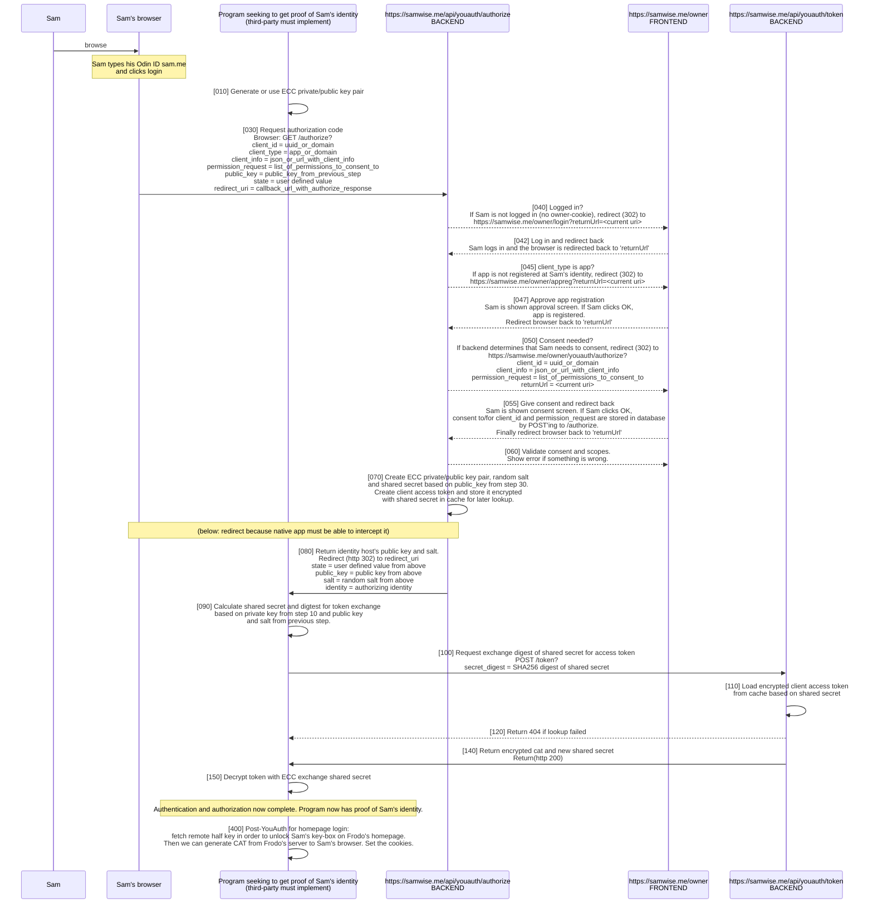

# YouAuth unified flow

---

The purpose of YouAuth is to:

- Obtain user consent for a `program` to access certain data.
- Return a machine readable token to the `program` facilitating said access.

`program` can be one of:

- `app` (single page or native app - e.g. photos.odin.earth)
- `domain` (e.g. frodo.me or shop.amazon.com)

## `authorize` endpoint

`GET` query parameters for the `authorize` endpoint:

- `redirect_uri` (required): The callback uri where the authorization parameters are delivered (see below).
- `client_type` (required): This parameter will help determine what kind of permissions go into the final Client Access Token (CAT). It can be one of the following values:
  - `app`: The client will use this value when it is an app. E.g. Sam logging on to photos app on his phone.
    - consent: An app always requires consent from the user.
  - `domain`: The client will use this value when it is a domain. E.g. Sam using his identity to log on to amazon.com or frodo.me/home.
    - consent: Consent will be necessitated for any domain unless Sam has previously granted approval for automatic consent on that specific domain. If `permission_request` is set, and is requesting permissions not already granted, then a consent is always required.
- `client_id` (required): unique identifier of the client. The value requirement depends on the `client_type`:
  - `app`: The value is required and should be a uuid.
  - `domain`: The value must match the callback domain in the `redirect_uri`.
- `public_key` (required): Base64 encoded ECC public key.
- `state` (optional): A value included in the request that is also returned in the authorization callback response/redirect.
- `permission_request` (optional): (tbd) list of explicit permissions the CLIENT is requesting. E.g. "drive:xyz:read drive:xyz:write".
- `client_info` (optional): (tbd) JSON structure with CLIENT details (e.g. name, description, list of scopes, signature, etc.) shown on consent screen. Alternatively a URL from which the json structure can be fetched.

The response to the `authorize` endpoint is delivered using `HTTP 302 Redirect` to `redirect_uri` parameter with the following query parameters:

- `identity`: The identity id.
- `public_key`: The identity host's public key (required below).
- `salt`: The identity host's random salt (required below).
- `state`: Copy of the user defined state data.

## `token` endpoint

`POST` body parameters for the `token` endpoint:

- `secret_digest`: SHA256 digest of the ECC shared secret calculated from {client private key from step 10, identity host public key from step 80, identity host random salt from step 80}. It must match the digest created on the identity host during `authorize`.

The response to the `token` endpoint is a JSON object with the following members:

- `base64SharedSecretCipher`: The AES CBC encrypted new shared secret. Use base64SharedSecretIv (below) and shared secret from step 90 to decrypt.
- `base64SharedSecretIv`: (see above)
- `base64ClientAuthTokenCipher`: The AES CBC encrypted CAT. Use base64ClientAuthTokenIv (below) and shared secret from step 90 to decrypt.
- `base64ClientAuthTokenIv`: (see above)

## `Shared secret` calculation
Both the identity host and the third-party site compute the shared secret independently using their private keys and the other party's public key, combined with a random salt provided by the identity host. The formula for the shared secret could be expressed as:

    Shared Secret = HKDF(ECDH(private_key_self, public_key_other_party), salt)

This ensures that both parties derive the same shared secret without transmitting it over the network. Using a KDF strengthens the shared secret by ensuring it's uniformly random and resistant to attacks. It also allows the incorporation of the salt in a cryptographically secure manner.
